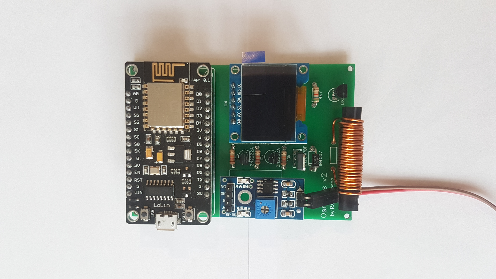
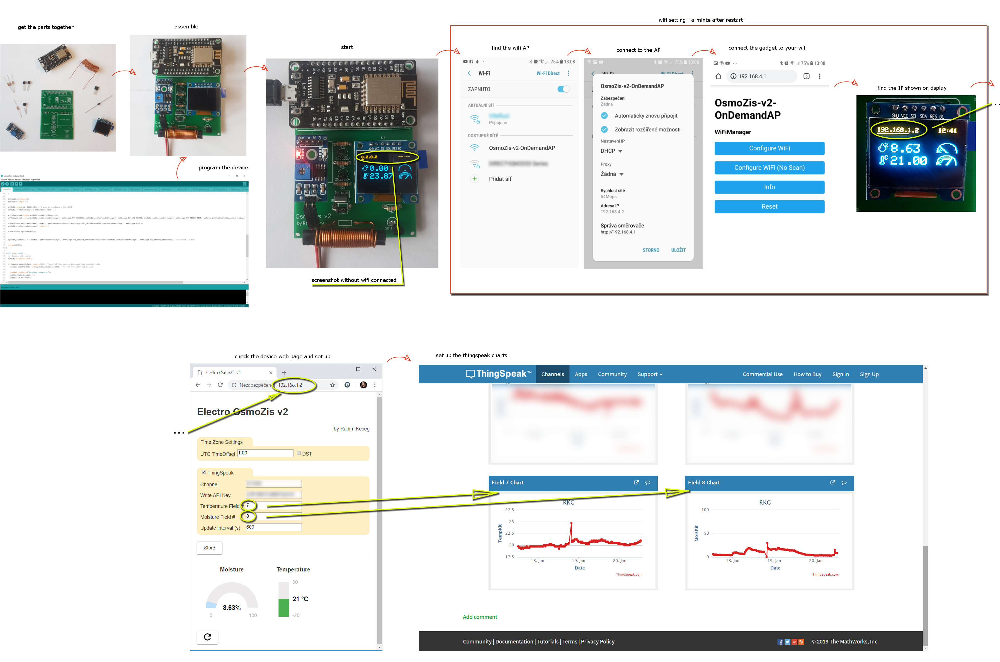

# OsmoZis v2 - osmóza - neinvazivní vysoušení vlhkého zdiva

... in other languages [english](README.en.md)

Potřebujete se zbavit vzlínající vlhkosti ve vašem domě? Typicky u starého domu s problematickou izolací základů?

Bez zbytečných průtahů a přílišné teorie, je jistá šance, že zařízení, které je zde popsané Vám může pomoci.

# Jak to funguje?
Zjednodušeně řečeno, toto zařízení generuje nízko frekvenční špičky, které eliminují síly které umožňuje vodnímu roztoku ve zdi překonat gravitaci a vyhrát nad silou, které způsobuje vzlínání, a voda se vrátí zpět do země.

Může to znít jako kouzlo, nicméně experimentálně byla funkčnost úspěšně ověřena.

Pokud se chcete dozvědět více detailů od expertů, určitě najdete na internetu spoustu článku a videí které by Vám mohli pomoci porozumět principu elektro-osmozy. Zajímavé video může být například v následujícím odkazu https://www.youtube.com/watch?v=hDw9_C7s-Mk.

# Je možné taková zařízení koupit?
Samozřejmě že ano, jen hledejte OSMO-něco ... jen jsou tato zařízení příliš drahá a jediné, jak člověk pozná že něco dělají je svítící dioda bez další možnosti, jak si průběžně ověřit, že zařízení funguje.

Toto je levné zařízení, které stojí jen zlomek ceny (asi 200 - 500kč za součástky dle toho, kde je koupíte) naproti tomu co je nabízeno na trhu (20000 - 50000 kč), ale poskytuje mnohem více funkcí:
* na displeji je možné vidět aktuální vlhkost
* dále i aktuální teplotu
* zařízení se dá připojit na wifi
  * kde dále vidíte jeho adresu
  * a aktuální čas
* s dalšími nastaveními
  * časová zóna
  * a odesílání dat na cloud (www.thinkgspeak.com) kde můžete vidět grafy vlhkosti a teploty online každý 10 minut standardně (nebo si interval nastavit dle osobních preferencí)

# Co potřebuji na to si zařízení vyrobit?
v adresáři ["img"](img), najdete návrh obvodu zařízení, dále výrobní data pro desku a další obrázky, které vám pomohou celé zařízení vytvořit.

# Jak zařízení oživit?
v tomto adresáři najdete kód programu, na který se můžete podívat a případně jej upravit, pokud nechcete jen jej nahrajte do ESP přímo.

Pokud chcete zkoumat kód, je třeba stáhnout některé další knihovny, jejichž seznam najdete níže.

1. <OneWire.h> 
2. <DallasTemperature.h>

3. <SPI.h>
4. <Wire.h>
5. <Adafruit_GFX.h>
6. "Adafruit_SSD1306.h"

7. <Interval.h>
8. <ThingSpeak.h>

9. <WifiManager.h> (tzapo)

10. ESP8266 desku a knihovny k ní

